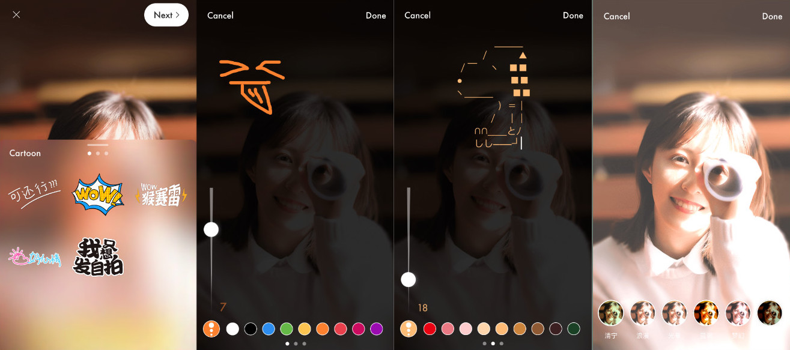

 
<div align="left">
	 
	 
	 
</div>

## WHStoryMaker
iOS 搭建美图——**贴纸，涂鸦，文字，滤镜**


小姐姐有没有很好看！是不是该点一波Star！（无耻，滚粗。。）(￣ε(#￣)☆╰╮o(￣皿￣///)

目前美图有四个功能:

**贴纸 | 涂鸦 | 文字 | 滤镜**



## WHStoryMaker接入说明：
#### 1.引用头文件

```objective-c
#import "WHStoryMakerHeader.h"
```

#### 2.初始化

```objective-c
StoryMakeImageEditorViewController *storyMakerVc = [[StoryMakeImageEditorViewController alloc] initWithImage:image];
[self presentViewController:storyMakerVc animated:YES completion:nil];
```
在初始化的时候传入 **Image**。

## License

WHStoryMaker is released under the MIT license. See LICENSE for details.
